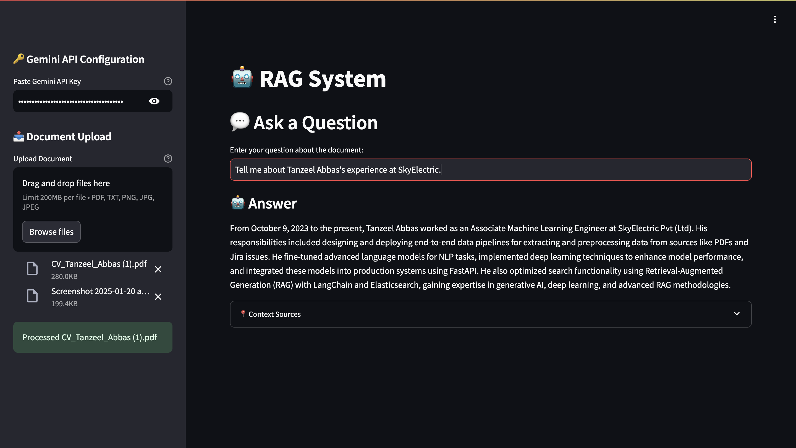

# Multi-Modal RAG System 

Advanced Retrieval-Augmented Generation system for document processing and question answering



## Features ✨

- **Multi-Document Support**
  - 📄 PDF (text + table extraction)
  - 🖼️ Images (OCR with Tesseract)
  - 📝 Text files
- **AI-Powered Q&A**
  - 💬 Natural language question answering
  - 🔍 Semantic search with ChromaDB
  - 🧠 LangChain integration
- **Enterprise Ready**
  - 🔐 Secure non-root Docker execution
  - 📈 Scalable vector database
  - 🔄 Async processing pipeline
- **Easy Integration**
  - 🐳 Docker-first deployment
  - 📡 REST API endpoints
  - ⚙️ Configurable via environment variables


## Getting Started 

### Prerequisites

- Docker Engine 20.10+
- Docker Compose 2.20+
- Python 3.11 

### Installation

```bash
# Clone repository
git clone https://github.com/yourusername/multi-modal-rag-system.git
cd multi-modal-rag-system

# Create environment file
cp .env.example .env

# Build and start services
docker-compose up --build -d

# Verify containers
docker-compose ps

```

## Dual Access Points 

1. **REST API** - Programmatic access at `:8080`
2. **Web Interface** - User-friendly UI at `:8501`

## Access Points 

| Component        | Type       | URL                          | Port  |
|------------------|------------|------------------------------|-------|
| API Documentation| Swagger UI | http://0.0.0.0:8080/docs     | 8080  |
| Streamlit App    | Web UI     | http://0.0.0.0:8501          | 8501  |
| API Base URL     | REST Endpoint| http://0.0.0.0:8080        | 8080  |


### Tanzeel Abbas
### Machine Learning Engineer
